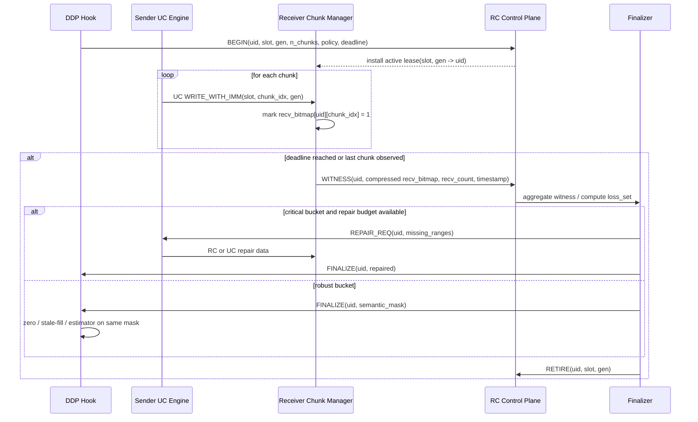

# 在 RoCEv2 UC 与 PyTorch DDP 并发 bucket 中将不可见丢包语义化为可归属梯度缺失

## Executive summary

这类问题的难点，不是“分布式训练能不能容忍丢包”本身，而是**在真实 RoCEv2 UC + DDP 并发 bucket + RDMA Write-with-Immediate 的实现约束下，丢包默认是不可见、不可归属、也不可被所有 rank 一致解释的**。NVIDIA 的 RDMA 文档明确指出，UC 连接不可靠，包可能丢失，传输层不会重试，错误处理必须由更高层协议完成；同时 UC 仍支持 RDMA Write-with-Immediate。另一方面，verbs/DOCA 文档又说明，Write-with-Immediate 在远端只暴露一个 **32-bit immediate value**，而且远端必须预先投递 receive 才能成功接收该 immediate；普通 RDMA Write 则不会像 Write-with-Immediate 那样给远端一个对应的 completion 语义。这意味着：**如果你想在 UC 上保留 tail 优势，又不想把丢包退化成 silent corruption，那么“wire-visible attribution state”本身就是一等公民问题。** citeturn42view0turn41view0turn36view1turn36view0turn36view2

从公开文献看，最接近你要解决的问题的，不是梯度稀疏化，而是 **MLT / LTP / PLOT / OptiReduce** 这条“bounded-loss / semi-reliable / time-bounded”路线。它们已经证明了三件事：其一，训练过程对一部分通信不完美是可容忍的；其二，tail latency 往往比平均带宽更伤训练时间；其三，如果把“丢包”从纯网络事件提升为训练层可解释的对象，就可以换取更好的 time-to-accuracy。尤其是 MLT 已经把 **tensor ID + offset + bitmap + zero-fill/stale-fill** 组合成了较完整的语义链，OptiReduce 则把“**bounded-time completion**”推到 collective 层，并在公开实现里明确暴露了并发 bucket 限制。citeturn30view0turn30view3turn35view0turn35view2turn12view0turn31view0turn10view2turn28view1turn29view2turn29view4

但同样重要的是：**我没有在本次检索覆盖到的公开文献与公开实现里，找到一个同时满足以下四个条件的系统**：  
一是 **RDMA UC**；二是 **Write-with-Immediate 作为 fast path 远端可见元数据**；三是 **PyTorch DDP 并发 bucket**；四是 **显式 completion attribution + 可恢复/可统一解释的丢包语义**。MLT/LTP/PLOT 主要做的是 UDP 或用户态 shim；OptiReduce 用的是 Gloo + DPDK 自定义头，而且公开实现当前只支持两个并发 bucket，并要求把 `bucket_cap_mb` 设得很大；Octopus 这样的 RDMA 系统确实展示了 **用 Write-with-Immediate 承载语义标签** 的可行性，但它们不处理训练中的 silent loss 归属。citeturn28view1turn29view2turn29view4turn23view0turn24view0turn42view0

因此，**SemiRDMA 最值得发表的创新点，不应再把重心放在“不同层可容忍不同 loss ratio”这一点**，因为这条线已经被 DLCP/MLT/PLOT 充分预告过了；真正更强的论文主张应该是：**在真实 RDMA UC fast path 上，把“silent loss”提升为“attributable erasure semantics”**。也就是把“有没有收齐”从一个本地推断，变成一个可以被 bucket/phase/peer 精确归属、可以被所有 rank 一致解释、还可以在 deadline 内选择 repair / mask / stale-fill 的**显式协议语义**。DLCP/MLT/PLOT 给了你“loss tolerance”的应用动机，OptiReduce 给了你“time-bounded collective”的系统动机，RDMA/imm_data 文档则给了你“为什么这在 UC + Write-with-Imm 上本质更难”的实现动机。citeturn13view0turn11view4turn31view0turn10view2turn42view0turn41view0turn23view1

基于这些文献与实现约束，我认为最有潜力的方向是一个**见证式语义擦除层**：保留 UC 数据面与 ratio/deadline 推进，但增加一个轻量 RC 控制面，负责为每个 bucket-phase 发放短期 slot lease、回收 witness bitmap、统一发布 semantic mask 或 selective repair 决策。这样，SemiRDMA 的论文中心就会从“我们敢在 UC 上丢一点包”升级为“**我们把 UC 上本来不可见的丢包，做成了可归属、可控制、可恢复、且对并发 bucket 不混淆的语义对象**”。这比单纯强调 layer-wise tolerance 更新，也更贴近 UC/RoCEv2 无 PFC 的真实系统价值。citeturn35view0turn35view2turn29view1turn29view2turn42view0

## 相关工作与比较

为避免概念混淆，下面的“completion attribution”专指：**系统是否能把收到或缺失的数据片段，稳定地归属到正确的训练对象（tensor / bucket / transfer / phase）**；“可归属丢包语义”专指：**系统是否把丢失暴露为训练层可解释对象，而不是仅仅依赖 timeout、默认重传或本地隐式推断**。表中 “SemiRDMA” 一行基于你在题述里给出的系统描述，不是外部公开文献。citeturn29view1turn42view0turn41view0

| 论文 / 系统 | 问题域 | 关键机制 | 是否处理 completion attribution | 是否在 RDMA UC 上实现 | 是否提供可归属丢包语义 | 实验环境 | 主要结果与和 SemiRDMA 的关系 |
|---|---|---|---|---|---|---|---|
| Gradient Sparsification for Communication-Efficient Distributed Optimization（Wangni et al.，2018） citeturn38view1turn38view2 | 梯度稀疏化 | 用凸优化最小化 stochastic gradient 的 coding length，做近似最优稀疏化 | 否 | 否 | 否；它是**传前主动近似**，不是**传中丢失归属** | logistic regression、SVM、CNN；具体网络环境未指定 citeturn38view1turn38view3 | 这是“通信体积缩减”路线的代表，但它不触及 UC silent loss、远端 CQE 归属、bucket 并发。对 SemiRDMA 的意义主要是对照组：**它减少发送内容，而不是解释在网络里真正丢了什么**。 citeturn38view1turn38view2 |
| Deep Gradient Compression（Lin et al.，ICLR 2018） citeturn32view0turn32view2 | 梯度稀疏化 | 99.9% 梯度冗余假设 + momentum correction、local gradient clipping、momentum factor masking、warm-up | 否 | 否 | 否 | 多任务多数据集；可在 1GbE 上训练；压缩比 270×–600× citeturn32view0turn32view2 | DGC 证明了“不是所有梯度都必须密集发送”，但它不解决**真实并发传输时到底丢了哪个 chunk、属于哪个 bucket**。这条思想早已存在，因此 SemiRDMA 的独创性不能落在“梯度不必同等可靠”这件事上。 citeturn32view0turn32view2 |
| PowerSGD（Vogels et al.，NeurIPS 2019） citeturn39view0turn39view1 | 低秩梯度压缩 | 用 power iteration 做低秩近似，保留 all-reduce 兼容性 | 否 | 否 | 否 | 常见 CNN 与 LSTM；实现取得 consistent wall-clock speedups citeturn39view0turn39view2turn39view3 | 与 DGC 一样，它解决的是“**发什么**”，不是“**传丢了什么**”。对 SemiRDMA 的启发，是未来可把“可归属丢失”与“低秩/低比特”组合，但它本身不处理 attribution。 citeturn39view0turn39view2 |
| Distributed Learning over Unreliable Networks（Yu et al.，ICML 2019） citeturn32view3 | 理论上的不可靠网络训练 | 证明在随机拓扑 / 随机丢弃下，分布式学习可取得与可靠网络可比的收敛量级 | 否 | 否 | 部分；它承认“消息会掉”，但不提供系统级 chunk/bucket attribution | 理论分析 + network simulation；PS 场景 citeturn32view3 | 这是“训练能容忍不可靠网络”的理论背书，但它没有告诉你**如何在真实 verbs / CQE / bucket 并发里做归属**。SemiRDMA 可以把这项理论落到 UC-over-RoCE 的系统层。 citeturn32view3 |
| Rethinking Transport Layer Design for Distributed Machine Learning（Xia et al.，APNet 2019） citeturn32view5 | 面向 DML 的 bounded-loss transport 观点论文 | 提出 bounded-loss tolerance，主张故意忽略部分 packet loss 以降低 tail FCT | 否 | 否 | 部分；是设计宣言，不是细粒度语义协议 | preliminary results；1.1×–2.2× speedup；具体实现细节较少 citeturn32view5 | 这篇是 MLT / DLCP 路线的思想起点。它和 SemiRDMA 的关系不是“可比实现”，而是“问题设定源头”：**tail 比均值更致命，bounded-loss 值得做**。 citeturn32view5 |
| DLCP（Wang et al.，2020 arXiv） citeturn13view0turn13view1 | 面向 DNN 训练的 domain-specific transport 优化 | bounded loss tolerance + packet-level prioritization/dropping + per-packet load balancing | 否 | 否 | 部分；强调 bounded-loss，但公开摘要未展示 completion attribution 设计 | 10× V100 testbed + large-scale simulations；额外训练加速最高 84.3% citeturn13view0turn13view1turn13view2 | DLCP 已经覆盖了“层敏感”“包级优先级”等动机，因此 SemiRDMA 不能把 novelty 放在这些点上；真正差异在于 **RDMA UC + imm_data + DDP bucket** 的实现语义。 citeturn13view0turn13view2 |
| LTP（Chen et al.，IWQoS 2023） citeturn12view0turn12view1 | PS 架构下的 loss-tolerant transport | out-of-order transmission、out-of-order ACK、Early Close、Bubble Filling | 部分 | 否 | 是；丢失被 LTP 协议显式管理 | 8 worker + 1 PS；集成 PyTorch；吞吐最高可达 30× 提升 | 它已经展示了“**不要把所有丢包都交给 TCP 重传**”的价值，也做了 ACK/repair 语义；但它不面向 RDMA UC，也没有 DDP 并发 bucket attribution 这一层约束。 citeturn12view0turn12view3turn12view4 |
| MLT（Wang et al.，NSDI 2024） citeturn11view3turn10view3 | 面向分布式 DNN 训练的专用网络传输 | 每包负载均衡、梯度感知 queue/drop、bounded-loss tolerant transmission；头部编码 tensor id / length / offset / seqno；接收端按 offset 重构，丢失梯度填 0，丢失参数用上轮值；sender/receiver 用 probe + bitmap 做缺失查询与选择性重传 | **是** | 否；可靠 side channel 可用 TCP 或 RDMA RC，数据面用 UDP/TCP | **是** | 64× RTX3090，25Gbps testbed；对 BytePS/基线最高 12.0%–62.2% speedup，对 FSDP/LLM 最高 35.5%，并在仿真中把 tail FCT 相比 DCTCP 降低到 91.8% 量级 | 这是与你最接近的公开系统：它已经有 **ID/offset attribution + zero-fill + bitmap witness**。但它在 UDP/shim 层实现，**不是 RDMA UC + Write-with-Imm + DDP bucket 并发**；你的机会在于把它的“语义链”迁移到更受限的 RDMA fast path。 citeturn30view0turn30view3turn35view0turn35view1turn35view2turn10view5 |
| PLOT（Lu et al.，TNSM 2024） citeturn31view0 | 细粒度 packet loss tolerance | 利用 layer-specific loss tolerance，基于 UDP 做梯度传输，面向尾时延与训练时间优化 | 未指定 | 否 | 部分；公开摘要强调 loss tolerance，但未公开到 completion attribution 细节 | 小规模 testbed + 大规模 simulation；具体硬件指标未指定 | PLOT 再次证明“不同层对丢失敏感度不同”已不是新点。若 SemiRDMA 只强调 heterogeneous p_L，很容易被视为同一叙事的实现变体；要跳出来，必须把重心转到 **RDMA 语义、归属与恢复**。 citeturn31view0 |
| OptiReduce / Ultima 线（Warraich et al.，NSDI 2025；公开实现文档） citeturn25search6turn28view1turn28view2 | tail-optimal / time-bounded collective | TAR + Unreliable Bounded Transport + adaptive timeout + dynamic incast + Hadamard Transform；公开实现为 Gloo 后端上的 DPDK 层，自定义报头携带 offset/counter/timeout/length/rank/last；公开版本只支持 **2 个并发 bucket**，要求 `bucket_cap_mb=1350` | **部分**；用 separate rings 避免两个并发操作混包，但并未一般化解决多 bucket attribution | 否 | 部分；它把 collective 变成 bounded-time，但不是 per-chunk witness 语义 | 本地集群、CloudLab、模拟；GPT-2 收敛时间在多环境中优于基线；本地 VGG-19 实验显示在类似 drop rate 下，可借 early timeout / HT 加速且保持准确率 | 这项工作最直接地证明了：**时间边界很值钱，但并发 bucket 的系统复杂度很高**。它的公开实现把这个限制写得非常明确，所以 SemiRDMA 若能支持真实多 bucket attribution，会形成非常强的对照。 citeturn11view1turn11view2turn29view2turn29view3turn29view4 |
| Distributed Training under Packet Loss（Weintraub et al.，2025 arXiv） citeturn40view0turn40view3 | packet loss 下保持收敛与泛化 | unbiased gradient aggregation + bounded parameter drift；从“到达了什么”里重构一致梯度估计 | 否 | 未指定 | **是，但偏算法层** | LLaMA2 7B，64 GPUs；10% random packet loss 下 perplexity 变化不超过 0.8% | 这是很重要的“补齐块”：它说明**即使真有 packet loss，也可以从统计上维持正确性**。但它没有给出现实 DDP + UC fast path 下的 attribution 协议，因此很适合被 SemiRDMA 吸收为“mask/repair 之后的 estimator 规则”。 citeturn40view0turn40view1turn40view2 |
| PAFT（OpenReview 2025） citeturn32view4 | silent gradient aggregation error / SDC | 把 aggregation error 形式化为 gradient inconsistency，用周期性参数同步与动态异步调度抑制模型漂移 | 否 | 否 | 部分；关注“错误被建模与缓解”，不是 packet/chunk 归属 | PyTorch Distributed；ResNet、GPT-2、LLaMA-2；4–32 GPUs | PAFT 的价值在于提醒：**silent error 一旦进入梯度聚合，会累积为模型漂移**。这对 SemiRDMA 非常关键，因为你要解决的不是单次 bucket 完整性，而是长期训练中 silent loss 的可控性。 citeturn32view4 |
| SemiRDMA（基于题述） | RoCEv2 UC 上的 semi-reliable gradient allreduce | UC Write-with-Imm + 4096B chunk + completion bitmap + ratio controller + ghost mask；PR-C 把 `imm_data` 编成 `bucket_id:8 + chunk_id:24`，并用 pending queue 避免并发 bucket 混淆 | **是** | **是** | **部分**；能把“未被 CQE 证实”的 chunk 置零，但缺少 witness / repair / 跨 rank 统一解释 | CX-5 25GbE，RoCEv2，无 PFC；flat 与 layer-aware 两种 hook；bucket_cap 可调 | 你已经跨过了一步：把“UC silent loss”从完全不可见，推进到了“接收端可基于 CQE 推断缺失”。下一步真正有发表价值的，是把这层本地推断升级成**见证式、可恢复、跨 rank 一致的语义擦除协议**。 |

### RDMA 与 imm_data 的直接实现约束

下表不是训练论文，而是与你这个题目直接相关的**实现约束与启发**。它们解释了为什么 UDP 论文里的 header 方案，不能直接平替到 UC Write-with-Immediate 上。citeturn42view0turn41view0turn24view0

| 资源 | 关键约束 / 启发 |
|---|---|
| NVIDIA RDMA transport modes 文档 citeturn42view0 | UC 明确“不可靠、包可能丢失、不会重试”，但又支持 RDMA Write-with-Immediate；因此 **UC 上的 loss accounting 必须由上层协议自己完成**。 |
| libibverbs `ibv_poll_cq` 文档 citeturn41view0turn36view2 | 远端可见的 `imm_data` 只有 **32 bit**，且只有 `wc_flags` 带 `IBV_WC_WITH_IMM` 时才有效；这把 wire-visible attribution 空间压得非常紧。 |
| NVIDIA DOCA RDMA 文档 citeturn24view0turn36view1turn36view0 | 普通 RDMA Write 的 responder 侧没有对应 receive callback；而 Write-with-Immediate 要求远端先投递 receive，否则会 fatal。这意味着 fast path 必须同时考虑 **RQ 压力** 和 **远端通知语义**。 |
| Octopus（USENIX ATC 2017） citeturn23view0 | 用 RDMA Write-with-Imm 承载“self-identified RPC”，把发送者标识编码到 immediate data 中，说明 **imm_data 做语义标签是可行的**。 |
| Correct, Fast Remote Persistence citeturn23view1 | 明确指出：Write-with-Immediate 的目标地址若要靠 32-bit immediate data 识别，会受到明显限制。这直接支持 **用短 slot/token 指向外部 manifest，而不是把完整 bucket 身份硬塞进 imm_data**。 |

综合来看，公开工作已经覆盖了“bounded loss 值得做”“tail 需要被时间边界化”“bitmap/offset 有效”“layer sensitivity 存在”“imm_data 可以承载少量语义”这些拼图，但**拼图还没有在一个公开系统里，以 RDMA UC + DDP 并发 bucket 的方式拼完整**。这正是 SemiRDMA 可以主打的空白。citeturn35view0turn29view4turn23view0turn23view1turn42view0

## 常见范式与失败模式

把这批工作抽象一下，实际上主要有五种解法范式。重要的不是它们“有没有用”，而是它们**在哪个系统层面把不完美显式化**。citeturn32view5turn35view2turn40view3

| 范式 | 代表工作 | 适用场景 | 典型失败模式 | 对 SemiRDMA 的启示 |
|---|---|---|---|---|
| 显式 ACK / bitmap / selective retransmit | MLT、LTP citeturn35view0turn12view0 | 需要把“丢了哪些片段”精确显式化的系统 | 控制面膨胀；高并发下 ACK / bitmap 本身可能成为尾延迟来源 | 这是最接近 SemiRDMA 的范式，但要适配 **imm_data 只有 32 bit、UC 远端 completion 稀缺** 的约束。 |
| time-bounded best-effort | OptiReduce citeturn11view1turn11view2 | 训练时间被 P99 / straggler 拖慢，想优先收敛于 bounded latency | 若没有精确 attribution，超时推进会让“缺了什么”变成黑箱 | SemiRDMA 已有 ratio/deadline 雏形；下一步要在 **推进** 之前，先把 **缺失对象** 语义化。 |
| 稀疏化 / 有偏或无偏估计 | Wangni、DGC、PowerSGD、Distributed Training under Packet Loss citeturn38view2turn32view2turn39view0turn40view3 | 希望从统计层面保性能或保收敛 | 估计正确不等于 attribution 正确；对敏感层、相关丢失和 burst loss 更脆弱 | 这是“完成丢失语义化之后”的下游策略，而不是替代 attribution 的上游协议。 |
| transport-level metadata 扩展 | MLT header、OptiReduce header、Octopus self-identified RPC、imm_data 语义标签 citeturn30view0turn29view3turn23view0turn41view0 | fast path 需要低开销地携带对象身份 | 元数据空间太小会导致 wrap / reuse / stale packet alias | **这正是 SemiRDMA 的核心战场**。PR-C 已经迈出一步，但还需要 slot lease / generation / retire 机制。 |
| application-level masking / stale fill | MLT、当前 SemiRDMA 题述、PAFT 的 error-awareness citeturn30view3turn32view4 | 不想等待完全修复，愿意把缺失转成可接受扰动 | 若不同 rank 看到不同 mask，会形成模型漂移或隐式分叉 | Mask 不是问题，**不一致的 mask 才是问题**；因此必须补上 witness 与全局一致发布。 |

本质上说，当前 SemiRDMA 已经落在“**transport metadata 扩展 + application masking**”这两个范式的交叉点上；它的短板，不在“有没有大胆用 UC”，而在“**mask 之前的 attribution 仍然是本地推断，而不是被协议见证过的全局语义**”。这也是它与 MLT 最关键的分水岭：MLT 已经有 bitmap witness，而 SemiRDMA 还停留在 CQE-inferred ghost mask。citeturn35view0turn30view3

## 候选方案对比

基于上面的分析，我认为最可行的改进方向有三条。它们不是互斥的，但论文主线最好只选一条作为核心创新，其他作为 ablation 或扩展。citeturn35view0turn29view4turn23view1

| 方案 | 原理 | 实现要点 | 预期对收敛 | 预期对 step-time | 复杂度与风险 | 最关键验证 |
|---|---|---|---|---|---|---|
| 代际租约槽位归属 | 把当前 `bucket_id mod 256` 升级成 **slot lease + generation**，把 full bucket 身份移到 RC manifest；UC fast path 只传短 token | `imm_data` 不再直接代表 full bucket，只代表 `(slot, chunk, gen)`；增加 BEGIN / RETIRE 控制消息；slot 未退役前不复用 | 与当前接近，但能明显降低 false attribution / alias corruption | 中位数几乎不变，P99 更稳；控制开销很小 | 改动小、实现稳，但对真正 silent loss 只解决“归属”，不解决“修复/一致解释” | 长跑 + >256 buckets wrap test；并发 bucket 从 2 提到 32+ 时的 false attribution rate |
| 见证式语义擦除协议 | 保留 UC 数据面，但引入 RC 控制面回收 **witness bitmap**，把缺失提升为显式语义对象；按 bucket policy 做 repair 或统一 mask | BEGIN / WITNESS / RETIRE；压缩 bitmap；对 critical bucket 做 selective repair，对 robust bucket 发布 semantic mask；所有 rank 看到同一份 erasure semantics | **最好**；因为“缺了什么”不再由每个 rank 各自猜，而是被协议统一发布 | 中位数略增，P95/P99 应明显好于全 RC，也会比当前 ghost-mask-only 更稳 | 中等复杂度；需要控制面压缩、RQ 补给、mask 一致性与 repair budget | 收敛、P99 step-time、byte-wise UC share、semantic decision mix、mask consistency、false attribution rate |
| 重要性感知奇偶修复 | 对敏感 bucket/layer 做轻量 parity stripe；deadline 内无需 RC 重传即可恢复单个 chunk 丢失 | 每 K 个 data chunk 发送 1 个 parity chunk；碰到单丢失时局部恢复，多丢失则回落到 mask/repair | 对 burst-sparse loss 很可能优于纯 mask | 额外带宽开销固定，可能略降平均吞吐，但减少部分重传尾巴 | 最高复杂度；需要编码/解码、stripe 管理和与 ratio/deadline 协同 | 不同 loss burst 模式下的恢复率、额外带宽、对敏感层精度收益 |

如果目标是**强化 SemiRDMA 的独创性**，我不建议把第一种作为最终论文主线。它是正确而必要的工程补丁，但更像“把 PR-C 做稳”。第三种很有研究味道，但复杂度高，而且容易把论文重心拉到编码/FEC。**最适合作为主创新点的，是第二种：见证式语义擦除协议。**它既正中你的问题定义——“把不可见的 UC 传输丢包变成可归属、可控制、可恢复语义的梯度缺失”——又能把现有 PR-C、ghost mask、ratio controller 都自然升级进去。citeturn35view0turn35view2turn23view1turn42view0

## 最终建议方案 CLEAR

下面给出我认为最有潜力的最终方案草案。我把它命名为 **CLEAR**：**Completion-Labeled Erasure Attribution for RoCE UC**。核心思想不是“让 UC 变可靠”，而是**让 UC 上的不完整交付，变成被协议明确标注过的擦除对象**。这比简单重传更贴合 time-bounded 目标，也比纯 ghost mask 更安全。其设计动机来自 MLT 的 bitmap witness、OptiReduce 的 deadline 推进、Octopus/verbs 的 imm_data 语义携带，以及 RDMA UC 文档对高层错误处理的要求。citeturn35view0turn11view1turn23view0turn41view0turn42view0

### 设计目标

CLEAR 的目标有四个。

第一，**准确归属**。每个到达或缺失的 chunk，都必须能归到唯一的 `(step, bucket, phase, peer-edge, chunk)`。这一步优先于 repair。否则后面所有 mask/补救都建立在可能错误的对象归属之上。这个目标直接回应了 DDP bucket 会重建、早期 `GradBucket.index()` 不稳定，以及 UC/imm_data 只有很少 fast-path 元数据的问题。citeturn29view1turn41view0turn23view1

第二，**显式见证**。当前 ghost mask 的问题，不是它“会置零”，而是它的依据只是“本地在 deadline 前没见到 CQE”。CLEAR 要把这种“未见到”变成被接收端 bitmap、控制面回执、必要时跨 rank 合并之后的**witnessed erasure**。这一步是把 silent loss 从局部推断变成协议事实。MLT 已经在 UDP 路线上证明了 bitmap/probe/selective retransmit 的有效性；CLEAR 把这一思路搬到 UC + Write-with-Imm。citeturn35view0turn35view2

第三，**统一解释**。对于一个 UC bucket，所有参与 rank 最终必须看到**同一条语义决策**：该 chunk 是 present、repaired、masked 还是 stale-filled。否则即便每个 rank 都“合理处理了本地缺失”，全局模型状态仍可能分叉。这一点和 PAFT 对 silent aggregation error 的警告是一致的。citeturn32view4

第四，**时间边界下的可恢复**。CLEAR 不追求“任何缺失都必须补齐”，而是在 deadline 约束内，根据 bucket policy 做三类动作：完全交付、有限修复、显式 mask。这样既保留 SemiRDMA 的 tail 优势，也不会把一切退回 RC。OptiReduce 的价值就在于提醒我们，**bounded-time** 不是“尽量快”，而是“在确定的时间内给出语义封闭结果”。citeturn11view1turn11view2

### 协议流程



这个时序里，最关键的不是 BEGIN 或 REPAIR，而是 **WITNESS**。没有它，系统仍然只是“看到多少算多少”；有了它，系统才能把 bucket 从“未完成网络事件”变成“已完成语义决策”。这一思想和 MLT 的 probe/bitmap 同源，但这里的对象不是 UDP 包，而是 **UC Write-with-Imm 驱动的 transfer lease**。citeturn35view0turn35view2turn36view1

### imm_data 与控制面布局

我建议把当前 `bucket_id:8 + chunk_id:24` 重新设计为**短槽位租约**，而不是把完整 bucket 身份直接塞进 immediate data。原因很直接：公开文档已经说明，Write-with-Immediate 只有 32-bit immediate data；而正确、快速的做法常常是让这 32 bit 只做“索引”，把完整语义放到外部状态表里。Octopus 与 remote persistence 相关工作都给了非常好的先例。citeturn41view0turn23view0turn23view1

建议的数据面位域如下：

```text
imm_data 32 bit
31                    24 23                            4 3        0
+-----------------------+-------------------------------+----------+
| slot_id      (8)      | chunk_idx            (20)    | gen (4)  |
+-----------------------+-------------------------------+----------+
```

这个布局有三个优点。  
一是 `chunk_idx` 仍然很大。用 4 KiB chunk 时，20 bit 就能表示 1,048,576 个 chunk，对应 4 GiB bucket，上限远高于 DDP bucket 的现实需求。  
二是 `gen` 让 slot 复用不再完全依赖“等旧包自然消失”的侥幸。  
三是真正的对象身份被移到 RC 控制面的 `uid`，使你不再被 `bucket_id mod 256` 绑死。

控制面建议至少有三类消息：

| 消息 | 关键字段 | 作用 |
|---|---|---|
| `BEGIN` | `uid, slot_id, gen, step_seq, bucket_seq, phase_id, peer_edge, n_chunks, policy, deadline` | 安装租约，把 `(slot_id, gen)` 绑定到 full transfer identity |
| `WITNESS` | `uid, recv_bitmap_compressed, recv_count, t_observed, maybe checksum` | 把“哪些 chunk 到了/没到”显式化 |
| `RETIRE` | `uid, slot_id, gen` | 释放 lease，允许 slot reuse |

这里的 `uid` 不建议直接取 `GradBucket.index()`。PyTorch 文档明确提醒，bucket 会在第一轮之后重建，因此训练早期不应依赖 index 稳定性。更合理的做法是：在 warm-up 后生成一个稳定的 `bucket_seq` 或基于 parameter list / manifest hash 的 transport-local identity。citeturn29view1

### pending 与 ack 管理

CLEAR 需要的状态并不复杂，但必须严格。

接收端应维护一个 `active_lease[(peer_qp, slot_id, gen)] -> uid` 哈希表，以及一个 `recv_bitmap[uid]`。所有 CQE 都先按 `(peer_qp, slot_id, gen)` 查 lease；命中则记账，未命中则进入 `prebegin_pending`。这样即便 UC 数据先于 RC `BEGIN` 到达，也不会被误归到错误 bucket。等 `BEGIN` 到达后，再把 pending 里的 CQE 归档。这个逻辑就是把你现在 `pending queue` 的思想，从“foreign bucket”扩展到“**foreign / stale / pre-begin lease**”三类。citeturn29view1turn41view0

`recv_bitmap` 的编码方式不需要过度复杂。bucket 小时直接发位图；bucket 大但缺失稀疏时发 range list 或 RLE；如果缺失太密，则直接触发 fallback，不值得在控制面上搬运一长串“坏消息”。MLT 用 bitmap + selective retransmit 已经证明这种 witness pattern 可行；CLEAR 只是把 witness 的对象从 UDP packet 序号，改成了 UC chunk 序号。citeturn35view0

`REPAIR_REQ` 不应该无条件触发。我的建议是设置 `repair_budget_bytes` 和 `repair_deadline_slack` 两个阈值：只有当 bucket 属于 critical class，且缺失量低于 budget，且剩余 slack 足够，才做 selective repair。否则直接发布 `SEMANTIC_MASK`。这样可以防止系统被少量异常 bucket 拖回 RC 行为。这个设计和 OptiReduce 的 bounded-time 思路一致，但比它更强调显式 erasure decision。citeturn11view1turn11view2

### failure 与 wrap 处理

当前 PR-C 已经解决了“仅靠 chunk_id 会跨 bucket 混淆”的第一层问题；CLEAR 需要解决的是第二层：**slot 复用、控制面与数据面乱序、长尾旧包、以及 bucket wrap 穿越多 step 的重影**。

推荐处理策略如下。

其一，`slot_id` 只在收到对应 `RETIRE` 后才允许复用；若控制面异常，则启动保守超时回收。  
其二，`gen` 为每次 slot 复用递增，哪怕只有 4 bit，也足够挡掉绝大多数 stale packet；当 `gen` 临近 wrap 时，强制执行一次 slot quarantine。  
其三，若 `WITNESS` 丢失或迟到，bucket 不应无限等待；此时用 `policy` 决定 fallback：critical 走 RC，robust 走全 bucket mask。  
其四，若接收端 receive queue 水位过低，应立即停止为该 bucket 继续发 Write-with-Imm，或转为 RC/普通 send 路径。DOCA 文档已经明确说明，没有预先 receive 的 Write-with-Immediate 会 fatal，这个风险不能只靠“平时够用”来回避。citeturn36view1turn24view0

### 与 PyTorch DDP 的集成点

CLEAR 与 DDP 的集成点，应该放在你已有 hook 架构之上，而不是重新发明一个 reducer。

最直接的切入点，仍然是 `register_comm_hook`。PyTorch 文档指出，hook 作用在 `GradBucket` 上，既能拿到 flatten 后的 `buffer()`，也能拿到 `get_per_parameter_tensors()` / `parameters()`，因此非常适合把 bucket 级 routing policy、layer sensitivity 和 transport lease 绑定起来。citeturn29view1

更具体地说：

- **warm-up 阶段**：第一轮或前几轮使用 RC / 保守模式，捕获 bucket rebuild 后的稳定 manifest。  
- **steady state**：对每个 ready bucket 分配 `bucket_seq`、`slot_id`、`gen`，并由 `layer_aware_dispatcher_hook` 选择 RC 或 CLEAR-UC。  
- **finalizer**：在 bucket future resolve 之前，由 finalizer 根据 `FINALIZE(uid, repaired / semantic_mask / stale-fill)` 修改 bucket buffer。  
- **policy source**：沿用你已有的 per-module `p_L` 注册，但 policy 不再只决定 “RC 还是 UC”，还决定 “UC bucket 的 finalize 策略”：`repair-first`、`mask-only`、`stale-fill`、`estimator-scale`。  
- **debug mode**：在抽样 bucket 上并行跑一个 shadow RC 校验通道，用于计算 false attribution rate 和 semantic mismatch rate。  

这里要特别注意一个细节：**不要把 transport identity 直接绑死在 `GradBucket.index()` 上**。文档已经提醒，bucket 会在第一轮后重建；因此最佳做法是等 reducer 稳定后生成 transport manifest，而不是把早期 index 当作 wire identity。citeturn29view1

### 为什么我认为它最有潜力

CLEAR 最强的地方，不是“比现有系统更 aggressive 地扔包”，而是**它第一次把 ‘RDMA UC 上不完整交付’ 做成了 DDP 能看懂、所有 rank 能对齐、deadline 内能 finalize 的对象**。MLT 的 closest idea 是对的，但它有充足的 UDP header；OptiReduce 的 tail story 是对的，但它公开实现目前明确只支持两并发 bucket；Octopus 证明了 imm_data 做标签可行，但不处理训练语义。CLEAR 刚好把这三条线接起来，因此既有系统性，也有新意。citeturn35view0turn29view4turn23view0

## 实验计划与评估指标

实验计划应该分成**协议正确性**、**性能**、**收敛**三条线，而且必须把“flat path regression”和“heterogeneous per-layer routing”拆开测。你在题述里已经指出，两者对应的是不同论文叙事；这个判断是对的。下面这套计划的目的，是先证明 CLEAR 不破坏现有 flat path，再证明它在多 bucket / 多策略下真正解决了 attribution 与 semantics。  

### 基线与对照

建议至少比较以下五个系统配置：

- **RC 基线**：全 RC，作为 accuracy 与 correctness 上界。  
- **当前 SemiRDMA**：PR-C + ghost mask。  
- **半成品最小增强**：仅做 slot/gen virtualization，不做 witness。  
- **CLEAR**：完整 BEGIN/WITNESS/RETIRE + semantic finalize。  
- **CLEAR + selective repair ablation**：验证 repair budget 的收益与代价。  

如果条件允许，再补一个 **OptiReduce 或 MLT 风格对照** 会非常有说服力，但若工程成本过高，至少要在文字里明确说明：OptiReduce 公开实现仅支持两个并发 bucket，因此它不是与你 bucket_cap_mb=1 heterogeneous DDP 设置完全同类的可运行对照。citeturn29view2turn29view4

### 负载与网络矩阵

模型建议至少包括一个 CNN、一个 transformer、一个小 LLM 微调场景。原因不是“模型越多越好”，而是这三类的 bucket 结构和层敏感性不同。PLOT/MLT 已经表明层位置和梯度大小会影响 loss tolerance；Distributed Training under Packet Loss 则提示大模型下 packet loss 也能在统计上可控。citeturn31view0turn10view4turn40view0

网络矩阵建议包含：

- `bucket_cap_mb ∈ {512, 25, 4, 1}`，验证从 flat 到多并发 bucket 的跨度；  
- packet loss / gray failure 注入：`0, 0.01%, 0.1%, 1%, 2%, 5%`；  
- burst loss 与随机 loss 两类；  
- background traffic 开 / 关，制造 incast 尾部；  
- bucket 数超过 256 的 wrap 压力测试；  
- receive queue 低水位压力测试；  
- 指定 heterogeneous policy：如 BN / LN / embedding 走 critical repair-first，conv / MLP 走 mask-first。  

MLT 已经在 gray failure 与不同 loss bound 下给出过非常有价值的基准：0.1%–1% 的随机丢包就足以让传统可靠传输明显退化，而 bounded-loss 方案可保持性能；OptiReduce 则说明 P99/50 扩大时 bounded-time collective 更具优势。CLEAR 应当在这两条坐标轴上同时打点。citeturn35view3turn35view2turn10view5

### 评估指标

建议把指标写得非常“论文范”，并且在系统里直接暴露。

| 指标 | 定义 / 解释 |
|---|---|
| 收敛指标 | top-1 / perplexity / validation loss；与 RC 基线比较 |
| `P50 / P95 / P99 step time` | 每个训练 step 的耗时分位数；这是 bounded-time 叙事的核心 |
| `accuracy drift` | 相比 RC 基线的最终精度差异，或达到同等精度时的时间差 |
| `byte-wise UC share` | `bytes_UC / (bytes_UC + bytes_RC_repair + bytes_RC_fallback + bytes_RC_control)` |
| `false attribution rate` | 被错误归属、或错误宣布为 missing 的 chunk 占比；建议用 shadow RC 校验作为 oracle |
| `semantic mismatch rate` | 各 rank 对同一 bucket 最终语义决策不一致的比例；CLEAR 目标应接近 0 |
| `repair yield` | 进入 repair 的 bucket 中，被成功修复而非 fallback mask 的比例 |
| `control-plane overhead` | BEGIN/WITNESS/RETIRE + bitmap bytes 占总通信量的比例 |
| `mask density` | 每 bucket 被 mask 的 chunk 比例；与精度漂移相关 |
| `RQ low-watermark events` | 由于 receive buffer 紧张触发 fallback 的次数 |

其中你点名的 **false attribution rate** 最值得认真定义。我建议定义为：  
**在开启 sampled shadow RC oracle 的 bucket 上，训练时协议层给出的归属/缺失判定，与 oracle 真实交付集合不一致的 chunk 数，占该样本 chunk 总数的比例。**  
这能把“协议很快”与“协议没把错东西零掉”区分开。这个指标对 CLEAR 极其重要，因为它直接测的是你的论文主张，而不是泛泛的精度或吞吐。  

### 实验顺序

实验不要一上来就跑 full convergence。更有效的顺序是：

先做 **protocol microbench**：slot wrap、prebegin pending、RC/UC 乱序、WITNESS 压缩效率、RQ 压力。  
再做 **flat path regression**：`bucket_cap_mb=512`，证明 CLEAR 加的控制面几乎不破坏现有路径。  
然后做 **bucket concurrency stress**：`bucket_cap_mb=1`，这是你真正打出区别的地方。  
最后再做 **end-to-end convergence**：heterogeneous p_L + per-layer route + repair policy。  

这样写论文时逻辑也最顺：先证明“协议正确”，再证明“并发可扩展”，最后证明“训练受益”。这会比直接甩一堆精度曲线更有说服力。citeturn29view2turn29view4turn35view2

## 开放问题与局限

有几点需要诚实标注。

首先，**PLOT 的公开实现细节不足**。我检索到了题目、摘要和 DOI，也能确定它强调 layer-specific loss tolerance 与 UDP-based transfer，但公开摘要没有给出足够的 completion attribution、header 格式和具体测试床细节，因此表中相应位置我标成了“未指定”或“部分”。citeturn31view0

其次，**LTP 与 BGTP 等工作更多面向 PS / UDP 或 poster 级 follow-up**。它们提供了很有价值的协议思想，但与“RoCEv2 UC + Write-with-Imm + DDP bucket 并发”相比，系统约束不同，不能直接拿来当严格 apples-to-apples 对照。citeturn12view0turn33search0

再次，**RoCE 官方文档总体仍站在 lossless Ethernet 的部署前提上**。因此你这个“无 PFC、并在 UC 上有界容忍丢包”的方向，本身就在标准部署假设之外。这既是机会，也是审稿时需要主动解释的地方：你不是在替代传统 RoCE，而是在探索一个 tail-optimized、语义封闭的 AI 训练特化路径。citeturn24view2turn42view0

最后，这份报告里对 **SemiRDMA 当前系统** 的分析，基于你在题述中提供的架构说明，而不是公开源码或论文。也正因为如此，我会把最核心的建议压在一个**与你现有实现最连续、但论文价值上最跳跃**的点上：**把 PR-C + ghost mask 升级成 witnessed erasure semantics**。如果只能押一个创新点，我会押这里。